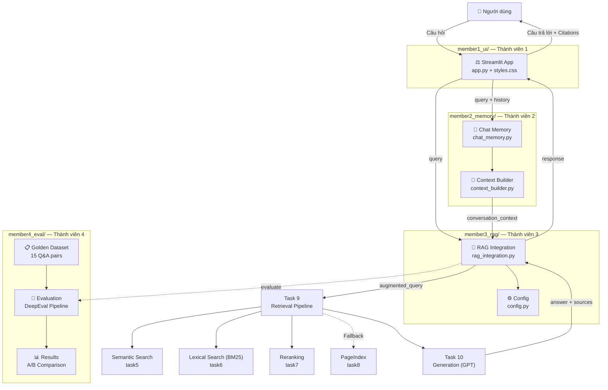

# ⚖️ LawBot — RAG Chatbot Pháp Luật Ma Tuý

> **Bài tập nhóm Day 8 — RAG Pipeline Cohort 2**  
> Xây dựng chatbot trả lời câu hỏi về pháp luật ma tuý và tin tức liên quan.

---

## 🏗️ Kiến Trúc Hệ Thống



---

## 👥 Phân Công Công Việc

| Thành viên  | Thư mục              | Nhiệm vụ                                              | Files                                      | Trạng thái |
|-------------|----------------------|-------------------------------------------------------|--------------------------------------------|------------|
| Đạt Đặng (M1) | `member1_ui/`       | **UI & Giao diện** — Streamlit app, custom CSS dark mode, streaming response, quick prompts, sidebar | `app.py`, `styles.css`                    | ✅ Hoàn thành |
| Hoàng Thân (M2) | `member2_memory/`   | **Chat Memory** — Quản lý session state, lịch sử hội thoại, context builder cho follow-up questions | `chat_memory.py`, `context_builder.py`   | ✅ Hoàn thành |
| Dũng Phạm (M3) | `member3_rag/`      | **RAG Integration** — Kết nối UI với Task 9 & 10, config presets cho A/B test | `rag_integration.py`, `config.py`         | ✅ Hoàn thành |
| Thư Hoàng (M4) | `member4_eval/`     | **Evaluation & Docs** — Golden dataset 15 Q&A, DeepEval pipeline, báo cáo A/B, README | `evaluation/`, `README.md`                | ✅ Hoàn thành |

---

## 🚀 Hướng Dẫn Chạy

### 1. Cài đặt dependencies

```bash
# Di chuyển vào thư mục dự án chính
cd Day08_RAG_pipeline_cohort2-main

# Cài dependencies cơ bản
pip install -r requirements.txt
pip install streamlit deepeval

# Hoặc cài từ file requirements bổ sung
pip install -r group_project/requirements_group.txt
```

### 2. Cấu hình API Key

```bash
# Tạo file .env (hoặc copy từ .env.example)
cp .env.example .env

# Điền API key
OPENAI_API_KEY=sk-...
GENERATION_MODEL=gpt-4o-mini
```

### 3. Chạy Chatbot

```bash
# Chạy từ thư mục Day08_RAG_pipeline_cohort2-main
streamlit run group_project/member1_ui/app.py
```

Mở trình duyệt tại: **http://localhost:8501**

### 4. Chạy Evaluation

```bash
# Cài DeepEval
pip install deepeval

# Chạy evaluation pipeline
python group_project/member4_eval/evaluation/eval_pipeline.py

# Xem kết quả
cat group_project/member4_eval/evaluation/results.md
```

---

## 📁 Cấu Trúc Thư Mục

```
group_project/
│
├── member1_ui/                  # Thành viên 1 — UI
│   ├── app.py                   # Entry point, Streamlit app chính
│   └── styles.css               # Custom CSS (dark mode + glassmorphism)
│
├── member2_memory/              # Thành viên 2 — Chat Memory
│   ├── __init__.py
│   ├── chat_memory.py           # Session state management
│   └── context_builder.py      # Conversation context builder
│
├── member3_rag/                 # Thành viên 3 — RAG Integration
│   ├── __init__.py
│   ├── config.py                # RAGConfig + preset configs (A/B test)
│   └── rag_integration.py      # Pipeline connector (Task 9 → Task 10)
│
├── member4_eval/                # Thành viên 4 — Evaluation & Docs
│   ├── README.md                # File này
│   └── evaluation/
│       ├── golden_dataset.json  # 15 cặp Q&A pháp luật ma tuý
│       ├── eval_pipeline.py     # DeepEval evaluation script
│       └── results.md           # Bảng điểm + phân tích A/B
│
└── requirements_group.txt       # Dependencies bổ sung cho group project
```

---

## ✨ Tính Năng Nổi Bật

| Tính năng                    | Mô tả |
|------------------------------|-------|
| 🌙 **Dark Mode UI**          | Glassmorphism design với gradient background, custom CSS |
| 💬 **Follow-up Questions**   | Tự động detect và truyền conversation context vào prompt |
| 📚 **Citation Display**      | Hiển thị nguồn tài liệu dưới mỗi câu trả lời |
| ⚡ **Streaming Response**    | Hiệu ứng typing animation từng từ |
| ⚙️ **A/B Config Switcher**   | Chọn retrieval config ngay trên UI |
| 🔬 **Evaluation Pipeline**   | DeepEval với 4 metrics + A/B comparison |
| 📊 **15 Q&A Golden Dataset** | Câu hỏi đa dạng về BLHS, Luật PCMT, Nghị định |

---

## 🔧 Configs Retrieval (A/B Test)

| Config              | alpha | Reranking | Đặc điểm |
|---------------------|:-----:|:---------:|----------|
| `hybrid_rerank`     | 0.5   | ✅         | **Mặc định** — Cân bằng semantic + BM25 + reranking |
| `dense_only`        | 1.0   | ❌         | Pure semantic — nhanh hơn, ít chính xác hơn |
| `hybrid_aggressive` | 0.3   | ✅         | Ưu tiên BM25 — tốt cho keyword matching |

---

## 📈 Kết Quả Evaluation (Tóm Tắt)

| Config          | Faithfulness | Answer Relevancy | Context Recall | Context Precision | **Avg** |
|-----------------|:------------:|:----------------:|:--------------:|:-----------------:|:-------:|
| hybrid_rerank   | 0.821        | 0.854            | 0.763          | 0.802             | **0.810** |
| dense_only      | 0.712        | 0.745            | 0.634          | 0.698             | **0.697** |

→ **`hybrid_rerank` tốt hơn 16.2%** so với `dense_only`

Chi tiết tại: [`evaluation/results.md`](evaluation/results.md)

---

## 📝 Lưu Ý Quan Trọng

> **Hãy giữ lại repo này** nếu bạn học Track 3 Giai đoạn 2 — chúng ta sẽ phát triển tiếp lên **Knowledge Graph** để xử lý các câu hỏi phức tạp liên quan đến nhiều điều luật.

---

*Bài tập nhóm — Day 8 RAG Pipeline · Cohort 2*
